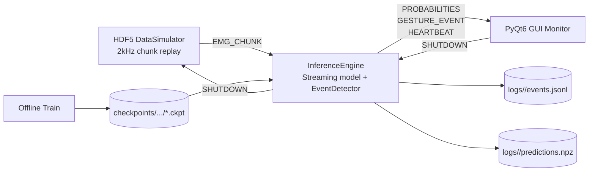

# RT-Gesture Workspace

实时离散手势识别系统工程目录，覆盖数据模拟、流式推理、事件检测、GUI 监控、离线训练与评估。

## Architecture



## Core Modules

| Module | Path | Responsibility |
|---|---|---|
| data simulator | `rt_gesture/data_simulator.py` | HDF5 按实时节奏回放，发布 EMG/ground-truth |
| inference engine | `rt_gesture/inference_engine.py` | 流式推理、状态恢复、延迟打点、事件发布、heartbeat |
| event detector | `rt_gesture/event_detector.py` | 阈值上穿 + 置信度拒识 + 去抖 + rest 抑制 |
| transport | `rt_gesture/zmq_transport.py` | msgpack + ndarray 的 ZMQ 传输封装 |
| GUI | `rt_gesture/gui/` | 波形/概率/事件监控、状态栏、后端进程控制 |
| training | `rt_gesture/train.py` | 离线训练（BCEWithLogits + FingerStateMask + MulticlassAccuracy） |
| evaluation | `rt_gesture/evaluate.py` | full vs streaming CLER 一致性评估 |

## API Snapshot

| API | Description |
|---|---|
| `InferenceEngine.run(max_messages=None)` | 启动推理主循环，消费 EMG 并发布概率/事件 |
| `InferenceEngine.register_event_callback(fn)` | 注册 Python 事件回调，接收 `GestureEvent` |
| `InferenceEngine.unregister_event_callback(fn)` | 取消已注册回调 |
| `DataSimulator.run(max_chunks=None)` | 启动数据回放循环 |
| `load_config(path)` / `save_config(config, path)` | 读取/写回运行配置 |
| `train_discrete_gestures(config)` | 执行训练并输出 checkpoint |
| `evaluate_cler_consistency(config)` | 评估 full/streaming CLER 差异 |

## Config Files

| File | Purpose |
|---|---|
| `config/default.yaml` | 默认运行配置（模拟器 + 推理 + GUI + logging） |
| `config/debug_short.yaml` | 小规模调试运行（限消息条数与独立端口） |
| `config/training.yaml` | 正式训练配置（`max_epochs: 250`） |
| `config/training_debug.yaml` | 快速训练验证配置（`max_epochs: 1`） |
| `config/evaluation.yaml` | CLER 评估配置 |

关键参数（`default.yaml`）：

| Section | Key | Default |
|---|---|---|
| `inference` | `heartbeat_interval_sec` | `1.0` |
| `inference` | `latency_warn_transport_ms` | `5.0` |
| `inference` | `latency_warn_infer_ms` | `10.0` |
| `inference` | `latency_warn_post_ms` | `5.0` |
| `inference` | `latency_warn_pipeline_ms` | `80.0` |
| `gui` | `heartbeat_timeout_sec` | `3.0` |

## Quickstart

```bash
cd workspace
python -m pip install -r requirements.txt
python -m pytest -q
```

默认配置期望 checkpoint 位于 `checkpoints/discrete_gestures/model_checkpoint.ckpt`。

可选初始化（若你已有旧路径模型）：

```bash
mkdir -p checkpoints/discrete_gestures
ln -sf ../generic-neuromotor-interface/emg_models/discrete_gestures/model_checkpoint.ckpt \
  checkpoints/discrete_gestures/model_checkpoint.ckpt
```

实时系统：

```bash
python scripts/run_realtime.py --config config/default.yaml
```

GUI：

```bash
python scripts/run_gui.py --config config/default.yaml
```

训练：

```bash
python scripts/run_training.py --config config/training.yaml
# 或快速验证
python scripts/run_training.py --config config/training_debug.yaml
```

评估：

```bash
python scripts/run_evaluation.py --config config/evaluation.yaml
```

## Development Guide

- 代码风格：遵循现有模块化结构，新增功能优先补充对应测试。
- 测试入口：`python -m pytest -q`（默认覆盖 `rt_gesture/tests`）。
- Benchmark：`pytest -m benchmark -q`。
- 依赖同步：`environment.yml` 通过 `-r requirements.txt` 统一安装，避免双份版本漂移。

## Runtime Outputs

- `checkpoints/`：训练产物目录（默认保留 `.gitkeep`）。
- `logs/`：运行日志目录（默认保留 `.gitkeep`）。
- 每次运行子目录包含：`runtime.log`、`events.jsonl`、`predictions.npz`。
